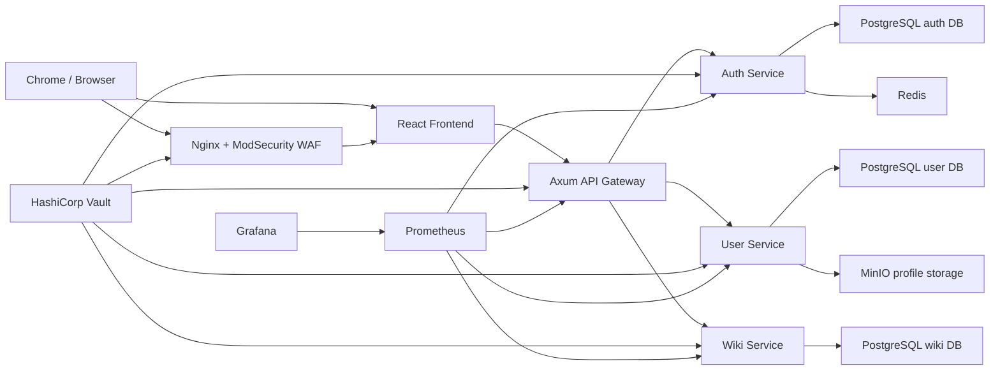
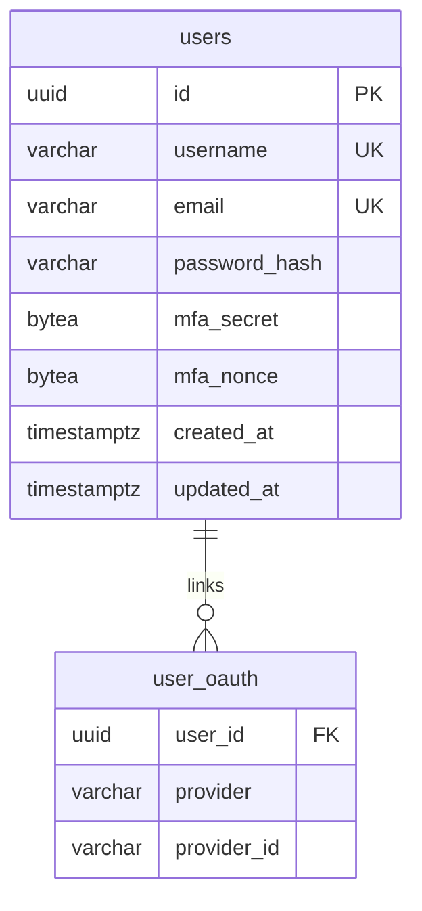
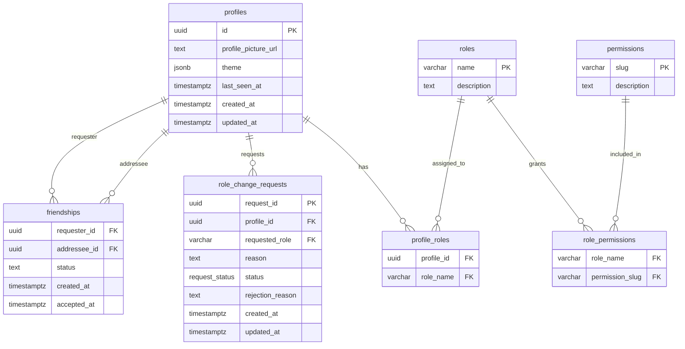
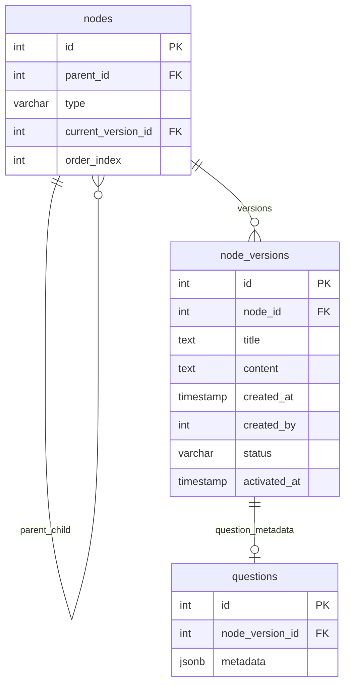

*This project has been created as part of the 42 curriculum by mbekheir, acaetano, jamar, jsommet, sdeutsch.*

# ATFQ

## Description

ATFQ, short for "Ask The Fucking Question", is a collaborative web platform for learning computer science concepts through a structured knowledge wiki.

The goal of the project is to provide more than a classic wiki: users can explore articles honing down on a single computer science subject and its relevant notions as well as key questions and resources. Authenticated contributors can propose new content or edits; moderators can review pending changes; and administrators can manage access through roles and permissions.

Key features:

- Public knowledge graph with articles, sub-articles, notions, questions, and resources.
- Secure account creation, login, logout, password reset, token refresh, and account deletion.
- OAuth login with Google and GitHub.
- Optional 2FA authentication.
- User profiles with avatar upload, persistent theme customization, roles, permissions, and friendship management.
- Moderated contribution workflow for wiki content.
- Administration dashboard for role requests and wiki version reviews.
- Legal pages: Privacy Policy and Terms of Service.
- Containerized microservice architecture with PostgreSQL, Redis, MinIO, Vault, ModSecurity, Prometheus, and Grafana.

## Instructions

### Prerequisites

Install the following tools before running the project:

- Docker.
- Task, used by the repository task files.
- SOPS, age, yq, and jq for encrypted secret management.

### Environment and secrets

The project does not commit runtime `.env` files. Service secrets are managed through Vault and SOPS.

1. Run `EDITOR=vim task vault:secrets:edit`

2. A vim buffer should open up, allowing you to edit the secrets

### Run the website

```bash
task dc:up -- vault
task vault:up
task dc:up
```

This is the single-command containerized deployment expected by the subject. It starts the frontend, API gateway, auth service, user service, wiki service, databases, object storage, Vault, WAF gateway, and monitoring stack.

After running this command once, you may run all containers using just `task dc:up`.

Main local URLs:

- Frontend through Vite/dev container: `http://localhost:8080`
- Swagger/OpenAPI: `http://localhost:8081/swagger-ui`
- Net gateway HTTPS entrypoint: `https://atfq.org` when local DNS/hosts and certificates are configured.
- Grafana: `http://localhost:3000`
- Prometheus: `http://localhost:9090`
- Mailpit: `http://localhost:8025`
- MinIO console: `http://localhost:9001`

### Useful commands

```bash
# Start every service
cd services && docker compose up --build

# Start in detached mode
cd services && docker compose up --build -d

# Stop services
cd services && docker compose down

# Follow logs
cd services && docker compose logs -f

# Production compose overlay
cd services && docker compose -f docker-compose.yaml -f docker-compose.prod.yaml up --build -d
```

### Frontend development

```bash
cd services/app
npm install
npm run dev
npm run lint
npm run build
```

### Backend development

Rust services:

```bash
cd services/auth
cargo test

cd ../api-gateway
cargo test

cd ../user
cargo test
```

Wiki service:

```bash
cd services/wiki
go test ./...
```

## Team Information

| Member | Role(s) | Responsibilities |
| --- | --- | --- |
| acaetano | Product Owner, Developer | Product direction, feature prioritization, wiki experience, content workflow validation. |
| jamar | Project Manager, Developer | Planning, task coordination, review flow, delivery tracking, frontend integration. |
| jsommet | Technical Lead, Developer | Architecture decisions, backend contracts, service boundaries, code quality. |
| mbekheir | Developer, DevOps/Security | Containerization, Vault, WAF, monitoring, authentication and API integration. |
| sdeutsch | Developer | User-facing features, profile management, accessibility checks, documentation support. |

All team members are expected to understand the global architecture, explain their own work, and demonstrate at least one implemented feature during evaluation.

## Project Management

The team organized the project around small vertical features rather than isolated technical layers. Each feature was discussed, split into backend/API/frontend tasks, implemented on Git branches, and reviewed before integration.

Practices used:

- Regular synchronization meetings for progress, blockers, and module validation.
- GitHub Issues or equivalent task tracking for backlog and assignments.
- Discord for daily communication and quick technical decisions.
- Pull request reviews for important changes.
- Shared architecture notes for service contracts, database decisions, and security choices.
- Meaningful Git commits from all members to show individual and collective work.

During evaluation, the team can explain how the work was distributed, how modules were selected, and how each member contributed to the final application.

## Technical Stack

### Frontend

- React 19 with TypeScript.
- Vite for development and production build.
- React Router for navigation.
- TanStack Query for server state and cache invalidation.
- Zustand for local application state.
- React Hook Form and Zod for forms and validation.
- Tailwind CSS 4 for styling.
- Ky for HTTP requests.
- MSW for frontend API mocking during development.

Why: React, Vite, and TypeScript provide a productive frontend framework with strong typing, fast iteration, and a component model that fits ATFQ's wiki, profile, and dashboard screens.

### Backend

- Rust API Gateway with Axum.
- Rust auth service with Tonic gRPC.
- Rust user service with Tonic gRPC.
- Go wiki service with gRPC.
- PostgreSQL for persistent relational data.
- Redis for auth cache/session-related workflows.
- MinIO/S3-compatible storage for profile images.
- SQLx for typed SQL access.
- Utoipa and Swagger UI for API documentation.

Why: the gateway exposes a clean HTTP API to the frontend while internal services communicate through gRPC. The split keeps authentication, profiles, and wiki logic isolated and easier to reason about.

### Infrastructure

- Docker Compose for single-command deployment.
- Nginx and OWASP ModSecurity CRS as the network gateway/WAF.
- HashiCorp Vault for secret injection through service-specific Vault agents.
- SOPS and age for encrypted secret files.
- Prometheus for metrics collection.
- Grafana for dashboards.
- Mailpit for local email testing.

Why: the infrastructure mirrors real production concerns: service isolation, HTTPS gateway, secrets management, observability, and reproducible deployment.

## Architecture



## Database Schema

ATFQ uses separate PostgreSQL databases per domain service.

### Auth database



### User database



### Wiki database



## Features List

| Feature | Description | Main contributors |
| --- | --- | --- |
| Public wiki browsing | Users can browse root articles, nested articles, notions, questions, and resources. | acaetano, jamar |
| Wiki creation and editing | Authenticated users can submit new articles and edits as pending versions. | acaetano, jsommet |
| Wiki moderation | Moderators/admins can approve or reject pending wiki versions. | jsommet, jamar |
| Authentication | Signup, login, logout, refresh tokens, password reset, account deletion. | mbekheir, jsommet |
| OAuth | Google and GitHub authentication and provider unlinking. | mbekheir |
| MFA | TOTP-based MFA enable, verify, and disable flow. | mbekheir, sdeutsch |
| Profile management | Username/email/password update, avatar upload/removal, theme customization. | sdeutsch, jamar |
| Friends and presence | User search, friend requests, accepted friends, online/last-seen status. | sdeutsch, mbekheir |
| Roles and permissions | Admin, moderator, user roles with permission-based UI and backend checks. | jsommet, mbekheir |
| Admin dashboard | Role request history/review and wiki moderation review surface. | jamar, jsommet |
| Legal pages | Privacy Policy and Terms of Service available from the application. | acaetano, sdeutsch |
| Monitoring | Prometheus metrics and Grafana dashboard. | mbekheir |
| WAF and secret management | ModSecurity gateway and Vault-managed service secrets. | mbekheir, jsommet |

## Chosen Modules

The project claims 15 module points. Only fully functional modules should be counted during evaluation.

| Category | Module | Type | Points | Implementation | Contributors |
| --- | --- | --- | ---: | --- | --- |
| Web | Use a framework for both frontend and backend | Major | 2 | React/Vite frontend and Axum/Tonic backend services. | jamar, jsommet, mbekheir |
| Web | Advanced search with filters, sorting, and pagination | Minor | 1 | Wiki search UI includes query, type filtering, title sorting, and paginated results. | acaetano, jamar |
| User Management | Standard user management and authentication | Major | 2 | Profile updates, avatar support, friends, online presence, and profile page. | sdeutsch, mbekheir |
| User Management | OAuth 2.0 remote authentication | Minor | 1 | Google and GitHub OAuth login/link/unlink flows. | mbekheir |
| User Management | Advanced permissions system | Major | 2 | Roles, permissions, role requests, admin review, and permission-gated actions. | jsommet, jamar |
| User Management | Complete 2FA system | Minor | 1 | TOTP MFA enable, verify, and disable with encrypted stored material. | mbekheir, sdeutsch |
| Cybersecurity | WAF/ModSecurity + HashiCorp Vault | Major | 2 | OWASP ModSecurity CRS gateway and Vault agents for isolated secret injection. | mbekheir, jsommet |
| DevOps | Monitoring with Prometheus and Grafana | Major | 2 | Metrics endpoints for services, Prometheus scrape config, Grafana provisioning. | mbekheir |
| DevOps | Backend as microservices | Major | 2 | API gateway, auth, user, and wiki services with separate databases and gRPC contracts. | jsommet, mbekheir |

Total: 15 points.

## Module Justification

- Frameworks: the project uses a real frontend framework and backend frameworks instead of a static page or ad hoc server.
- Advanced search: the wiki would be hard to navigate without filtering, sorting, and pagination, so this directly improves the product.
- Standard user management: profiles, avatars, friendship, and presence are core to a multi-user collaborative platform.
- OAuth: remote login reduces account friction and demonstrates provider integration.
- Advanced permissions: ATFQ needs trusted moderation and role separation to keep the knowledge base reliable.
- 2FA: protects contributor and moderator accounts, especially those with elevated permissions.
- WAF + Vault: the project handles authentication and user data, so gateway hardening and secret isolation are important.
- Monitoring: Prometheus and Grafana make service health visible and support debugging during multi-service deployment.
- Microservices: auth, user, and wiki domains have different responsibilities and storage needs; service separation keeps these boundaries clear.

## Individual Contributions

### acaetano

- Helped define the ATFQ product concept and user journey.
- Worked on wiki browsing and contribution workflows.
- Helped validate content structure: articles, notions, questions, and resources.
- Contributed to README/product documentation and evaluation preparation.

Main challenge: making the wiki feel structured enough for learning while keeping contribution forms understandable.

### jamar

- Coordinated planning, task breakdown, and frontend integration.
- Built or integrated React screens for wiki browsing, search, moderation, and navigation.
- Helped implement admin dashboard UX for role and wiki review flows.
- Participated in code reviews and cross-service integration testing.

Main challenge: keeping frontend state consistent while content versions, roles, and permissions change asynchronously.

### jsommet

- Led technical architecture and backend service boundaries.
- Implemented or reviewed gRPC contracts, role/permission workflows, and moderation logic.
- Worked on database schema design and data consistency.
- Reviewed critical backend and API gateway changes.

Main challenge: keeping domain services independent while still exposing a simple API to the frontend.

### mbekheir

- Implemented DevOps and security infrastructure: Docker Compose, Vault, ModSecurity, monitoring.
- Worked on authentication, OAuth, MFA, API gateway integration, and service secrets.
- Added metrics and operational tooling for local evaluation.
- Helped connect backend services to the frontend API client.

Main challenge: making the application reproducible with many containers while keeping secrets out of source code.

### sdeutsch

- Worked on user profile features, avatar handling, theme customization, and account settings.
- Helped implement friendship and presence user flows.
- Participated in accessibility and responsive UI checks.
- Supported documentation and evaluation readiness.

Main challenge: designing user settings that expose many account/security actions without becoming confusing.

## Security Notes

- Passwords are hashed with Argon2 and are never stored in plain text.
- MFA secrets are encrypted before storage.
- Access and refresh tokens are handled through the auth service.
- Protected routes use bearer tokens and backend authorization checks.
- Secrets are provided by Vault agents through service-local secret volumes.
- ModSecurity runs at the network gateway.
- User input is validated on the frontend and backend.
- The API gateway enforces request body limits for uploads.

## Multi-user Support

ATFQ supports multiple users simultaneously:

- Many users can register, log in, and browse the wiki at the same time.
- Contributions are stored as versions, which avoids overwriting the currently published article until moderation.
- Role requests and moderation actions are persisted and visible to authorized users.
- Friendships and presence data are stored in the user service.
- Services use PostgreSQL relations and constraints to reduce data corruption risks.

## Known Limitations

- The HTTPS gateway expects local host/certificate configuration for `atfq.org`.
- OAuth callbacks require provider credentials and redirect URLs configured in Vault.
- Some development URLs expose services directly for local testing.
- The project focuses on a collaborative knowledge platform, not a game; gaming modules are not claimed.
- Bonus modules should only be counted if they are demonstrated as fully functional during evaluation.

## Resources

Technical references used:

- React documentation: https://react.dev/
- Vite documentation: https://vite.dev/
- React Router documentation: https://reactrouter.com/
- TanStack Query documentation: https://tanstack.com/query/latest
- Tailwind CSS documentation: https://tailwindcss.com/
- Axum documentation: https://docs.rs/axum/latest/axum/
- Tonic gRPC documentation: https://docs.rs/tonic/latest/tonic/
- SQLx documentation: https://docs.rs/sqlx/latest/sqlx/
- PostgreSQL documentation: https://www.postgresql.org/docs/
- Docker Compose documentation: https://docs.docker.com/compose/
- HashiCorp Vault documentation: https://developer.hashicorp.com/vault/docs
- OWASP ModSecurity Core Rule Set: https://coreruleset.org/
- Prometheus documentation: https://prometheus.io/docs/
- Grafana documentation: https://grafana.com/docs/
- OAuth 2.0 overview: https://oauth.net/2/
- OWASP Web Security Testing Guide: https://owasp.org/www-project-web-security-testing-guide/

AI usage:

- AI was used to help structure documentation, especially this README, according to the ft_transcendence subject and evaluation checklist.
- AI was used for brainstorming wording, module justification, and checklist coverage.
- AI was not treated as an authority for project behavior; generated text must be reviewed by the team and kept consistent with the implemented code.
- Any AI-assisted content is the team's responsibility and should be explainable by team members during evaluation.

## Evaluation Checklist

Before the defense, verify:

- All team members are present and can explain their role and contributions.
- `README.md` is up to date with implemented modules only.
- `docker compose up --build` starts the whole stack from `services/`.
- Chrome console has no unexpected errors or warnings.
- Privacy Policy and Terms of Service are accessible from the UI.
- `.env` and unencrypted secrets are not committed.
- The database schema can be explained by at least two team members.
- Password hashing, OAuth, MFA, roles, and Vault can be demonstrated.
- Each claimed module can be shown live.
- The validated module count reaches at least 14 points.
