*This project has been created as part of the 42 curriculum by mbekheir, acaetano, jamar, jsommet, sdeutsch.*

# ATFQ

## Description

ATFQ, short for "Ask The Fucking Question", is a collaborative web platform for learning computer science concepts through a structured knowledge wiki.

The goal of the project is to provide more than a classic wiki: users can explore articles honing down on a single computer science subject and its relevant notions as well as key questions and resources. Authenticated contributors can propose new content or edits; moderators can review pending changes; and administrators can manage access through roles and permissions.

Key features:

- Public knowledge graph with articles, sub-articles, notions, questions, and resources.
- Secure account creation, login, logout, password reset, token refresh, and account deletion.
- OAuth login with Google and GitHub.
- Optional 2FA authentication.
- User profiles with avatar upload, persistent theme customization, roles, permissions, and friendship management.
- Moderated contribution workflow for wiki content.
- Administration dashboard for role requests and wiki version reviews.
- Legal pages: Privacy Policy and Terms of Service.
- Containerized microservice architecture with PostgreSQL, Redis, MinIO, Vault, ModSecurity, Prometheus, and Grafana.

## Instructions

### Prerequisites

Install the following tools before running the project:

- Docker.
- Task, used by the repository task files.
- SOPS, age, yq, and jq for encrypted secret management.

### Environment and secrets

The project does not commit runtime `.env` files. Service secrets are managed through Vault and SOPS.

1. Run `EDITOR=vim task vault:secrets:edit`

2. A vim buffer should open up, allowing you to edit the secrets

### Run the website

```bash
task up
```

This is the single-command containerized deployment expected by the subject. It starts the frontend, API gateway, auth service, user service, wiki service, databases, object storage, Vault, WAF gateway, and monitoring stack.

Main URLs:

- app: `https://atfq.org`
- grafana: `https://atfq.org/grafana`

### Useful commands

```bash
# Start every service
cd services && docker compose up --build

# Start in detached mode
cd services && docker compose up --build -d

# Stop services
cd services && docker compose down

# Follow logs
cd services && docker compose logs -f

# Production compose overlay
cd services && docker compose -f docker-compose.yaml -f docker-compose.prod.yaml up --build -d
```

## Team Information

| Member | Role(s) | Responsibilities |
| --- | --- | --- |
| mbekheir | Product Owner, Technical Lead, Developer, DevOps/Security | Product direction, Art Direction, technical architecture, authentication, OAuth, Vault, WAF, monitoring, design system, API integration, and delivery coherence. |
| jamar | Project Manager, Developer | Planning, task coordination, meeting follow-up, 2FA implementation, user management support, and integration tracking. |
| jsommet | Developer | Backend/frontend framework work, API and microservice integration, ORM/database usage, and shared module implementation. |
| acaetano | Developer | RBAC support, user management, backend/frontend framework work, API integration, ORM/database usage, and shared module implementation. |
| sdeutsch | Developer | Advanced search support, user-facing features, backend/frontend framework work, API integration, ORM/database usage, and shared module implementation. |

All team members are expected to understand the global architecture, explain their own work, and demonstrate at least one implemented feature during evaluation.

## Project Management

The team organized the project around small vertical features rather than isolated technical layers. Each feature was discussed, split into backend/API/frontend tasks, implemented on Git branches, and reviewed before integration.

Practices used:

- Regular synchronization meetings for progress, blockers, and module validation.
- GitHub pull requests for code review.
- Discord for daily communication and quick technical decisions.
- Shared architecture notes for service contracts, database decisions, and security choices.
- Meaningful Git commits from all members to show individual and collective work.

During evaluation, the team can explain how the work was distributed, how modules were selected, and how each member contributed to the final application.

## Technical Stack

### Frontend

Prototype
- Figma URL: https://www.figma.com/design/Wcn6Z4MUuzDb3OOM34E9VM/ATFQ-Prototype?node-id=65-69&t=oat3AzMCOrUZrXQ2-1

- React 19 with TypeScript.
- Vite for development and production build.
- React Router for navigation.
- TanStack Query for server state and cache invalidation.
- Zustand for local application state.
- React Hook Form and Zod for forms and validation.
- Tailwind CSS 4 for styling.
- Ky for HTTP requests.
- MSW for frontend API mocking during development.

Why: React, Vite, and TypeScript provide a productive frontend framework with strong typing, fast iteration, and a component model that fits ATFQ's wiki, profile, and dashboard screens.

### Backend

- Rust API Gateway with Axum.
- Rust auth service with Tonic gRPC.
- Rust user service with Tonic gRPC.
- Go wiki service with gRPC.
- PostgreSQL for persistent relational data.
- Redis for auth cache/session-related workflows.
- MinIO/S3-compatible storage for profile images.
- SQLx for typed SQL access.
- Utoipa and Swagger UI for API documentation.

Why: the gateway exposes a clean HTTP API to the frontend while internal services communicate through gRPC. The split keeps authentication, profiles, and wiki logic isolated and easier to reason about.

### Infrastructure

- Docker Compose for single-command deployment.
- Nginx and OWASP ModSecurity CRS as the network gateway/WAF.
- HashiCorp Vault for secret injection through service-specific Vault agents.
- SOPS and age for encrypted secret files.
- Prometheus for metrics collection.
- Grafana for dashboards.
- Mailpit for local email testing.

Why: the infrastructure mirrors real production concerns: service isolation, HTTPS gateway, secrets management, observability, and reproducible deployment.

## Architecture

File: atfq.excalidraw

## Database Schema

ATFQ uses separate PostgreSQL databases per domain service.

### Auth database


### User database



### Wiki database



## Features List

| Feature | Description | Main contributors |
| --- | --- | --- |
| Frontend and backend frameworks | React/Vite frontend, Rust Axum/Tonic services, and Go wiki service organized around clear service boundaries. | mbekheir, jamar, jsommet, acaetano, sdeutsch |
| Public wiki browsing | Users can browse root articles, nested articles, notions, questions, and resources. | mbekheir, jamar, jsommet, acaetano, sdeutsch |
| Wiki creation and editing | Authenticated users can submit new articles and edits as pending versions. | mbekheir, jamar, jsommet, acaetano, sdeutsch |
| Wiki moderation | Moderators/admins can approve or reject pending wiki versions. | mbekheir, jamar, jsommet, acaetano, sdeutsch |
| API layer | HTTP endpoints exposed by the API gateway, gRPC contracts between internal services, and Swagger/OpenAPI documentation. | mbekheir, jamar, jsommet, acaetano, sdeutsch |
| Authentication | Signup, login, logout, refresh tokens, password reset, account deletion. | mbekheir |
| OAuth | Google and GitHub authentication and provider unlinking. | mbekheir |
| MFA | TOTP-based MFA enable, verify, and disable flow. | jamar |
| Profile management | Username/email/password update, avatar upload/removal, theme customization. | acaetano, mbekheir, jamar |
| Friends and presence | User search, friend requests, accepted friends, online/last-seen status. | acaetano, mbekheir, jamar |
| Roles and permissions | Admin, moderator, user roles with permission-based UI and backend checks. | mbekheir, acaetano |
| Admin dashboard | Role request history/review and wiki moderation review surface. | mbekheir, acaetano, jamar |
| ORM/database access | SQLx-based Rust persistence and sqlx-based Go persistence with migrations per service. | mbekheir, jamar, jsommet, acaetano, sdeutsch |
| Custom design system | Shared UI primitives, theme tokens, typography choices, reusable layout elements, and a Figma-supported visual direction. | mbekheir |
| Advanced search | Wiki search with filtering, sorting, pagination, and user/profile search support. | sdeutsch, mbekheir |
| Legal pages | Privacy Policy and Terms of Service available from the application. | mbekheir, jamar, jsommet, acaetano, sdeutsch |
| Monitoring | Prometheus metrics and Grafana dashboard. | mbekheir |
| WAF and secret management | ModSecurity gateway and Vault-managed service secrets. | mbekheir |

## Chosen Modules

The project claims 23 module points. Only fully functional modules should be counted during evaluation.

| Category | Module | Type | Points | Implementation | Contributors |
| --- | --- | --- | ---: | --- | --- |
| Web | Use a framework for both frontend and backend | Major | 2 | React/Vite frontend, Rust Axum/Tonic services, and Go wiki service. | mbekheir, jamar, jsommet, acaetano, sdeutsch |
| Web | API | Major | 2 | API gateway, REST endpoints, OpenAPI/Swagger documentation, and gRPC contracts between services. | mbekheir, jamar, jsommet, acaetano, sdeutsch |
| Web | Advanced search with filters, sorting, and pagination | Minor | 1 | Wiki search UI includes query, type filtering, title sorting, and paginated results; user search is available from profile flows. | sdeutsch, mbekheir |
| User Management | Standard user management and authentication | Major | 2 | Profile updates, avatar support, friends, online presence, role requests, and account settings. | acaetano, mbekheir, jamar |
| User Management | OAuth 2.0 remote authentication | Minor | 1 | Google and GitHub OAuth login/link/unlink flows. | mbekheir |
| User Management | Advanced permissions system | Major | 2 | Roles, permissions, role requests, admin review, and permission-gated actions. | mbekheir, acaetano |
| User Management | Complete 2FA system | Minor | 1 | TOTP MFA enable, verify, and disable with encrypted stored material. | jamar |
| Cybersecurity | WAF/ModSecurity + HashiCorp Vault | Major | 2 | OWASP ModSecurity CRS gateway and Vault agents for isolated secret injection. | mbekheir |
| DevOps | Monitoring with Prometheus and Grafana | Major | 2 | Metrics endpoints for services, Prometheus scrape config, Grafana provisioning. | mbekheir |
| DevOps | Backend as microservices | Major | 2 | API gateway, auth, user, and wiki services with separate databases and gRPC contracts. | mbekheir, jamar, jsommet, acaetano, sdeutsch |
| Database | ORM/database toolkit | Major | 2 | SQLx is used in Rust services and sqlx is used in the Go wiki service to structure database access and migrations. | mbekheir, jamar, jsommet, acaetano, sdeutsch |
| Module of choice | Multi-language / API / framework stack | Minor | 1 | The project combines Rust and Go backend services, React frontend, OpenAPI documentation, and gRPC service contracts. | mbekheir, jamar, jsommet, acaetano, sdeutsch |
| Module of choice | Figma-driven UI preparation | Minor | 1 | Figma was used to prepare the visual direction and align the custom ATFQ interface before implementation. | mbekheir |
| Module of choice | Custom-made design system | Major | 2 | Shared UI primitives, theme tokens, custom typography/theme settings, reusable navigation, and consistent ATFQ visual language. | mbekheir |

Total: 23 points.

## Module Justification

- Frameworks: the project uses a real frontend framework and backend frameworks instead of a static page or ad hoc server.
- API: the gateway exposes documented REST endpoints while internal services communicate through typed gRPC contracts.
- Advanced search: the wiki would be hard to navigate without filtering, sorting, and pagination, so this directly improves the product.
- Standard user management: profiles, avatars, friendship, and presence are core to a multi-user collaborative platform.
- OAuth: remote login reduces account friction and demonstrates provider integration.
- Advanced permissions: ATFQ needs trusted moderation and role separation to keep the knowledge base reliable.
- 2FA: protects contributor and moderator accounts, especially those with elevated permissions.
- WAF + Vault: the project handles authentication and user data, so gateway hardening and secret isolation are important.
- Monitoring: Prometheus and Grafana make service health visible and support debugging during multi-service deployment.
- Microservices: auth, user, and wiki domains have different responsibilities and storage needs; service separation keeps these boundaries clear.
- ORM/database toolkit: SQLx keeps database access explicit while still providing typed rows, migrations, and structured persistence code.
- Multi-language/API/framework module of choice: the project demonstrates integration across Rust, Go, React, REST, OpenAPI, and gRPC rather than a single monolithic stack.
- Figma module of choice: the interface was prepared from a visual design source before being translated into reusable frontend components.
- Custom design system: ATFQ has reusable UI primitives and theme behavior instead of one-off screen styling.

## Individual Contributions

### acaetano

- Worked on the advanced permissions system with mbekheir.
- Contributed to user management with mbekheir and jamar.
- Participated in the shared frontend/backend framework work.
- Participated in API integration, microservice behavior, and ORM/database usage.
- Helped validate content structure: articles, notions, questions, and resources.

Main challenge: keeping user-facing account and permission flows understandable while the backend rules became more detailed.

### jamar

- Acted as Project Manager and coordinated planning, task breakdown, and progress tracking.
- Implemented the 2FA flow.
- Contributed to user management with acaetano and mbekheir.
- Participated in the shared frontend/backend framework work.
- Participated in API integration, microservice behavior, and ORM/database usage.

Main challenge: coordinating delivery while security-sensitive authentication features required careful integration and testing.

### jsommet

- Participated in the shared frontend/backend framework work.
- Contributed to API and microservice integration.
- Worked with the shared ORM/database layer and service migrations.
- Helped keep backend contracts and service boundaries consistent.
- Participated in integration and evaluation preparation.

Main challenge: keeping domain services independent while still exposing a simple API to the frontend.

### mbekheir

- Acted as Product Owner and Technical Lead.
- Implemented remote authentication with OAuth 2.0 for Google and GitHub.
- Implemented DevOps and security infrastructure: Docker Compose, Vault, ModSecurity, Prometheus, and Grafana.
- Worked on the advanced permissions system with acaetano.
- Contributed to user management with acaetano and jamar.
- Worked on advanced search with sdeutsch.
- Built the custom-made design system and prepared the Figma-based visual direction.
- Participated in the shared framework, API, microservice, and ORM/database modules.

Main challenge: making the application reproducible with many containers while keeping secrets out of source code.

### sdeutsch

- Worked on advanced search functionality with mbekheir.
- Participated in the shared frontend/backend framework work.
- Participated in API integration, microservice behavior, and ORM/database usage.
- Contributed to user-facing features and evaluation readiness.
- Helped test flows from the user perspective.

Main challenge: making search and user-facing workflows practical while the content and profile data came from multiple services.

## Security Notes

- Passwords are hashed with Argon2 and are never stored in plain text.
- MFA secrets are encrypted before storage.
- Access and refresh tokens are handled through the auth service.
- Protected routes use bearer tokens and backend authorization checks.
- Secrets are provided by Vault agents through service-local secret volumes.
- ModSecurity runs at the network gateway.
- User input is validated on the frontend and backend.
- The API gateway enforces request body limits for uploads.

## Multi-user Support

ATFQ supports multiple users simultaneously:

- Many users can register, log in, and browse the wiki at the same time.
- Contributions are stored as versions, which avoids overwriting the currently published article until moderation.
- Role requests and moderation actions are persisted and visible to authorized users.
- Friendships and presence data are stored in the user service.
- Services use PostgreSQL relations and constraints to reduce data corruption risks.

## Known Limitations

- The HTTPS gateway expects local host/certificate configuration for `atfq.org`.
- OAuth callbacks require provider credentials and redirect URLs configured in Vault.
- Some development URLs expose services directly for local testing.
- The project focuses on a collaborative knowledge platform, not a game; gaming modules are not claimed.
- Bonus modules should only be counted if they are demonstrated as fully functional during evaluation.

## Resources

Technical references used:

- React documentation: https://react.dev/
- Vite documentation: https://vite.dev/
- React Router documentation: https://reactrouter.com/
- TanStack Query documentation: https://tanstack.com/query/latest
- Tailwind CSS documentation: https://tailwindcss.com/
- Axum documentation: https://docs.rs/axum/latest/axum/
- Tonic gRPC documentation: https://docs.rs/tonic/latest/tonic/
- SQLx documentation: https://docs.rs/sqlx/latest/sqlx/
- PostgreSQL documentation: https://www.postgresql.org/docs/
- OpenAPI specification: https://spec.openapis.org/oas/latest.html
- Docker Compose documentation: https://docs.docker.com/compose/
- HashiCorp Vault documentation: https://developer.hashicorp.com/vault/docs
- OWASP ModSecurity Core Rule Set: https://coreruleset.org/
- Prometheus documentation: https://prometheus.io/docs/
- Grafana documentation: https://grafana.com/docs/
- Figma documentation: https://help.figma.com/
- OAuth 2.0 overview: https://oauth.net/2/
- OWASP Web Security Testing Guide: https://owasp.org/www-project-web-security-testing-guide/

AI usage:

- AI was used to help structure documentation, especially this README, according to the ft_transcendence subject and evaluation checklist.
- AI was used for brainstorming wording, module justification, and checklist coverage.
- AI was not treated as an authority for project behavior; generated text must be reviewed by the team and kept consistent with the implemented code.
- Any AI-assisted content is the team's responsibility and should be explainable by team members during evaluation.